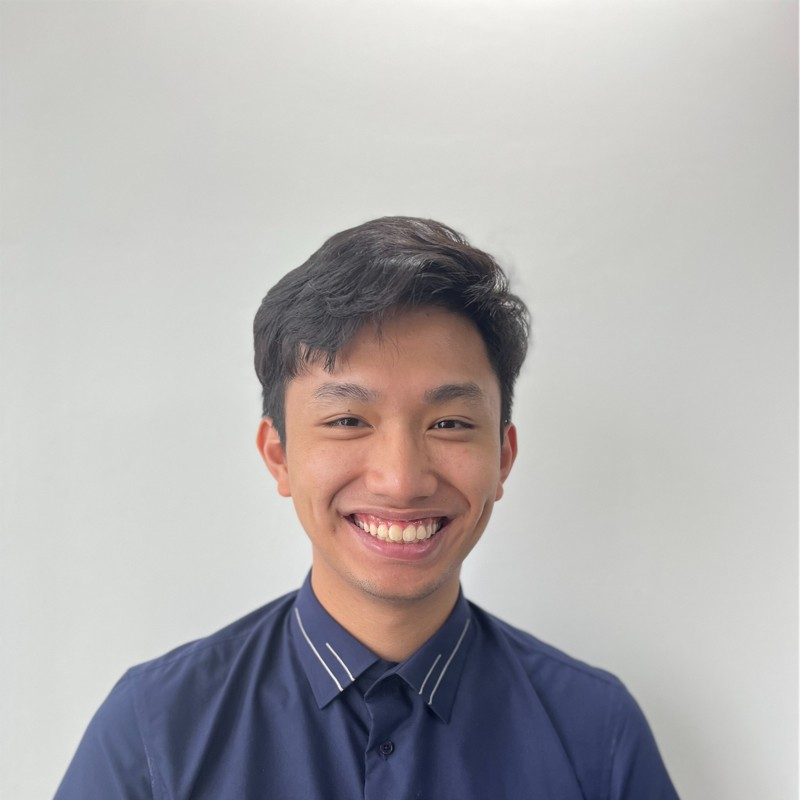

# About Me 

I am Minh Duc Hoang (Damian/Duc), a senior student at the University of Toronto St. George Campus pursuing a HBSc in Computer Science (Specialist/Honors)   

I grew up in Hanoi, Vietnam and came to Toronto in 2018 to pursue higher education in one of the world most developed cities. Prior to university, I went to Hanoi-Amsterdam High school for the Gifted for a study in Physics where I meet many amazing people.

Currently, I am a quantitative research associate at Harvard 

My research interests include: 
+ Machine Learning 
+ Computational Social Science
+ Quantitative Finance

In late 2020/early 2021, I had the valuable experience to research on time-series prediction for infectious disease modelling using Neural Network. Inspired by Neural ODE structure, we produced interesting results in Black Sigatoka prediction. Our work won [Project X 2020](https://www.projectx2020.com/), a international research competition for undergraduate with the theme this year being 'Climate Change' and was awarded $20000. It is proudly presented on [University of Toronto's website](https://www.utoronto.ca/news/prize-winning-u-t-student-team-uses-ai-beat-banana-blight), [UofT Department of Computer Science's website](https://web.cs.toronto.edu/news-events/news/how-to-beat-banana-blight-prize-winning-u-of-t-student-team-turns-to-novel-neural-network), and the school largest student run newspaper - [The Varsity](https://thevarsity.ca/2021/01/31/u-of-t-ai-conference-highlights-use-of-machine-learning-to-address-the-climate-crisis/?fbclid=IwAR1SEmYQSDbnNUrBu8yMl_rB-3I5QrvJ0uf3Yrs3UuzDxHq0wMNTkIPask0). Our work is presented at ICML 2021 Climate Change AI Workshop

### Professional Experience:
+ Data Engineer Intern at [Meta](https://about.meta.com/?utm_source=about.facebook.com&utm_medium=redirect)
	- Built data transformation features, data pipelines, analysis metrics, ... to improve integrity enforcements on Meta's new initiatives
	- Supervisor: Deniss Zenkovs

+ Research Associate at [Harvard](https://www.harvard.edu/)
	-  Conducted quantitative finance and computational social science researches at [Laboratory of Innovation Science](https://lish.harvard.edu/)
	-  Supervisor: [Dr. Hashim Zaman](https://lish.harvard.edu/people/hashim-zaman)
+ Software Engineer Intern, Machine Learning at [Huawei Technologies Canada](https://www.huawei.com/)
	- AI Engine Team at Toronto Distributed Scheduling and Data Engine Lab, working on optimizations for [OpenLookEng](https://openlookeng.io/docs/docs/overview.html)
	- Supervisor: [Dr Micheal Li](https://ca.linkedin.com/in/michael-l-72519124)
+ Research Intern at [VinAI Research](https://www.vinai.io/)
	- Research Topic: Face Parsing
	- Supervisor: [Dr. Anh T Tran](https://sites.google.com/site/anhttranusc/)
+ Research Assistant at [Sargent Group](https://light.utoronto.ca/)
	- Research Topic: Using NLP to mine perovskites' fabrication data and produce a semantic graph for Inverse Design
	- Supervisor: [Hitarth Choubisa](https://www.linkedin.com/in/choubisa/)
+ Software Engineer Intern at [FPT AI](https://fpt.ai/)
	- Vision team, worked on OCR platform
	- Supervisor: [Minh Nguyen](https://www.linkedin.com/in/minhnd3796/)

### Extracurricular Activities
+ One of 6 representatives of UofT at [Project X 2020](https://www.projectx2020.com/), using AI to tackle problems in climate-influenced infectious diseases
+ Third-place Intramural Soccer Open Tournament with our tri-campus Vietnamese team at UofT
+ Founder and Leader of [Windchimes Project](https://www.facebook.com/windchimesproject/), a non-profit community project to raise awareness of our cultural values

### Publications
[Forecasting Black Sigatoka Infection Risks with Latent Neural ODEs](https://arxiv.org/abs/2012.00752) - International Conference in Machine Learning (ICML) 2021
